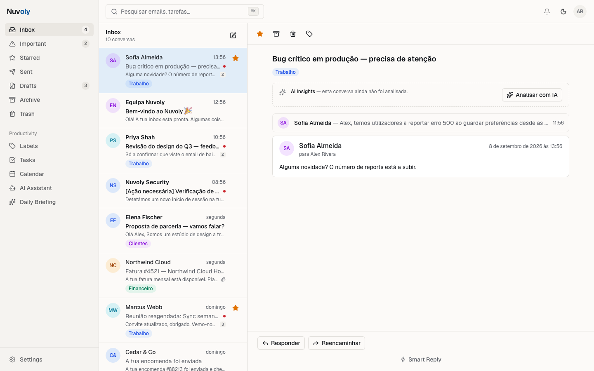
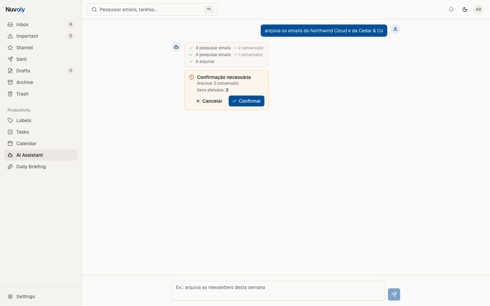
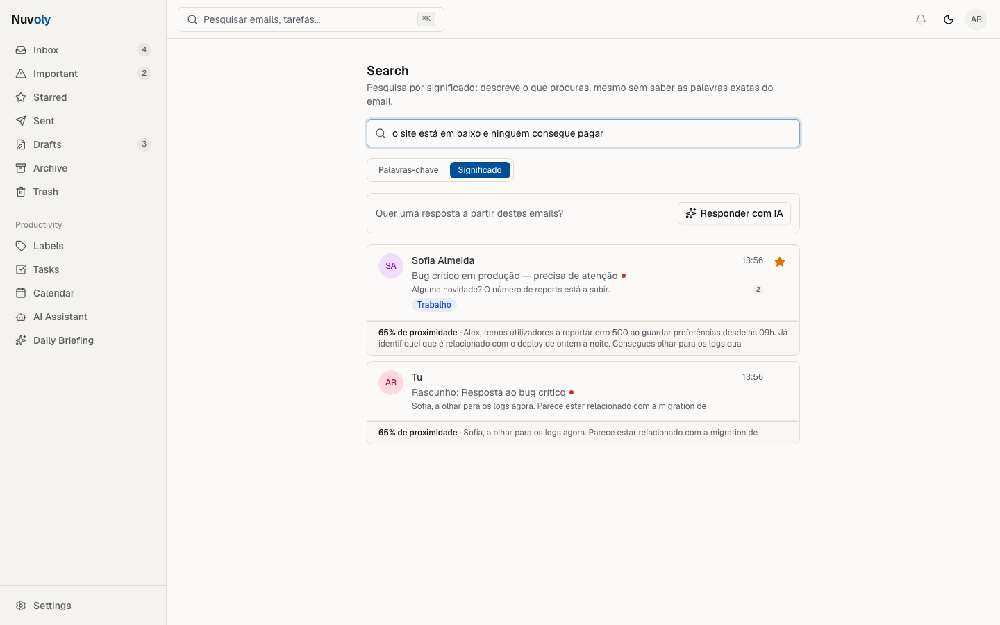
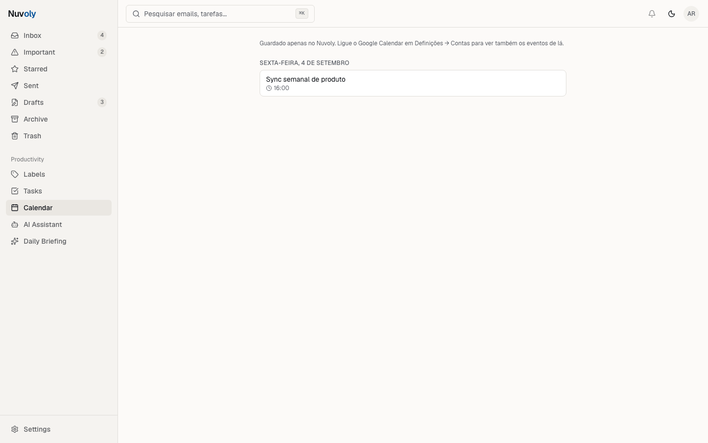
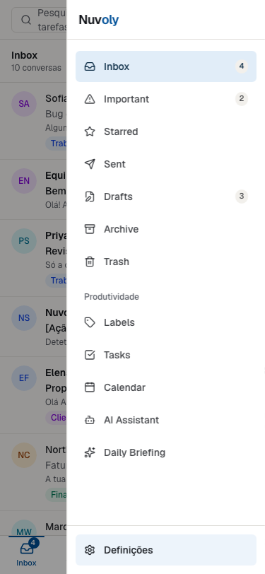
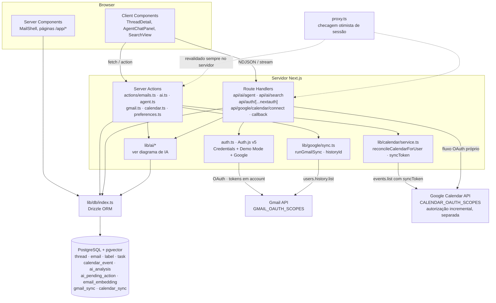
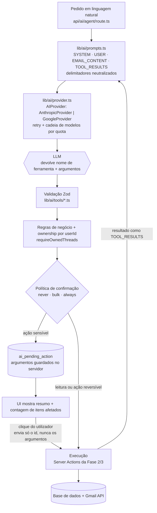
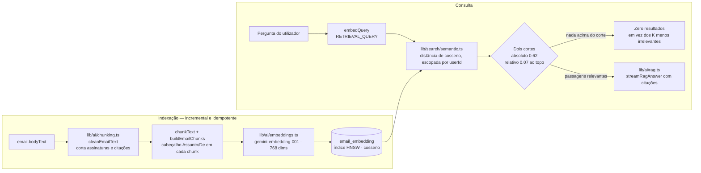

# Nuvoly

**Your inbox, intelligently managed.**

SaaS de gestão inteligente de email com IA integrada como copiloto — não um
chatbot ao lado, mas parte da própria experiência de gerir a inbox.

> Projeto de portfólio construído por fases. O plano completo (64 secções)
> está em [`docs/master-spec.md`](./docs/master-spec.md); o estado detalhado
> e as decisões de execução de cada fase em
> [`docs/status.md`](./docs/status.md). O percurso, os problemas reais e o
> que ficou por fazer estão no [**case study**](./CASE_STUDY.md).

## Demo

**[Ver ao vivo](DEMO_URL_A_PREENCHER)** · entrar com **"Explorar demo sem
conta"** (ou `demo@nuvoly.app` / `demo1234`).

O Demo Mode é o caminho principal, não um plano B: entra sem ligar conta
nenhuma e **todas as funcionalidades de IA funcionam** sobre um dataset
fictício de 20 conversas — insights, gerador de respostas, o agente com
tool calling e a pesquisa semântica.

> **O login com Google não funciona para um visitante qualquer, e isso é
> propositado.** O projeto Google Cloud está em modo *Testing*, onde só
> emails adicionados como test user conseguem autenticar. Sair disso exige
> submeter a app a revisão da Google — desproporcionado para um projeto de
> portfólio, e passaria a pedir acesso ao Gmail real de desconhecidos. A
> integração com o Gmail e o Google Calendar está implementada e testada
> com contas reais (ver [case study](./CASE_STUDY.md)); o que o link
> público demonstra é o Demo Mode.

## Screenshots

| Landing | Inbox com AI Insights |
| --- | --- |
|  |  |

| Agente a pedir confirmação | Pesquisa por significado |
| --- | --- |
|  |  |

| Calendário | Navegação mobile |
| --- | --- |
|  |  |

Capturados por `pnpm screenshots` (Playwright) contra o Demo Mode — nunca
contra uma conta de email real.

## Features

**Email**
- Inbox de duas colunas com pastas (inbox, importantes, com estrela,
  enviados, rascunhos, arquivo, lixo), threads expansíveis e contagens
- Ações: ler, estrela, arquivar, mover para o lixo, apagar definitivamente,
  responder, reencaminhar
- Compose com autosave de rascunho; labels (criar, aplicar, filtrar)
- Pesquisa por assunto, remetente e conteúdo — **e por significado**
- Command palette (⌘K) e atalhos de teclado

**Gmail e Calendar reais**
- Login com Google; sincronização real via Gmail API, **incremental** a
  partir da segunda vez (`users.history.list`)
- Envio e rascunhos reais; estrela, lido, arquivar e labels propagados
- Google Calendar com autorização **separada** e incremental: cria, lê e
  reconcilia eventos (`syncToken`)

**IA**
- **AI Insights** por conversa: resumo, categoria, prioridade, intenção,
  sentimento e ação sugerida — a pedido, com cache
- **Gerador de respostas** com tom e comprimento; **smart replies**
- **Ações de IA no compose**: melhorar, encurtar, traduzir, continuar
- **Agente com tool calling** (21 ferramentas): pesquisa, lê, resume,
  arquiva, etiqueta, cria rascunhos, tarefas e eventos — e **pede sempre
  confirmação** antes de qualquer ação sensível, com a contagem de itens
- **Pesquisa semântica / RAG** sobre pgvector, com resposta citada
- **Daily Briefing** com contagens calculadas em SQL e o texto por cima
- Extração de tarefas e deteção de reuniões, sempre como propostas

**Produto**
- Demo Mode de um clique, dark mode desenhado (não invertido), navegação
  mobile própria, onboarding de 4 passos

## O que foi construído, fase a fase

**Fase 1 — Foundation**
- Next.js 16 (App Router, Turbopack, React 19.2), TypeScript strict
- Design system próprio sobre Tailwind CSS v4 + Radix UI (light/dark, tokens OKLCH)
- Autenticação (Auth.js v5): login/signup por credenciais + **Demo Mode** de um clique
- PostgreSQL + Drizzle ORM, schema de utilizadores/sessões/preferências
- Layout da app: sidebar, topbar, command palette (⌘K), 14 rotas de `/app/*`
- Onboarding de 4 passos (foco, nível de IA, funcionalidades) persistido em BD
- Landing page completa (hero, features, workflow, pricing, FAQ)
- Rota `/proxy.ts` protege `/app/*` e `/onboarding` (checagem otimista); cada
  Server Action/Route Handler revalida a sessão antes de tocar na BD

**Fase 2 — Email**
- Schema real de email: `threads`, `emails`, `attachments`, `labels`,
  `threadLabels` — multi-tenant (tudo escopado a `userId`), com pastas
  (inbox/sent/drafts/archive/trash), estrelas, prioridade e categoria
- Dataset de demonstração realista: 20 threads / 24 emails / 5 labels em
  português, gerado por `pnpm db:seed` (idempotente, reexecutável)
- Inbox de duas colunas (lista + detail) com contagens por pasta na sidebar,
  thread expansível com histórico de mensagens
- Ações: ler, responder, estrela, arquivar, mover para o lixo, apagar
  definitivamente — todas via Server Actions que revalidam a sessão e a
  posse do recurso no servidor antes de mutar
- Compose com autosave de rascunho (debounced) e envio (modo demo — grava em
  Sent, sem envio real de email)
- Labels: criar, aplicar/remover a uma thread, apagar, navegar por label
- Search por assunto/remetente/conteúdo (`/app/search`) — a pesquisa
  semântica chegou na Fase 6, como um segundo modo
- Suite E2E (Playwright, `pnpm test:e2e`) cobrindo o fluxo crítico: login →
  abrir thread → estrela → arquivar/restaurar → lixo → compose/enviar →
  responder → labels → search

**Fase 3 — Gmail**
- Login real com Google (OAuth, `next-auth`), a par do Credentials/Demo Mode
  já existentes — `access_type=offline`+`prompt=consent` para garantir
  `refresh_token`; tokens persistidos na tabela `account` (o mesmo adapter
  da Fase 1) e renovados automaticamente quando expiram
  (`src/lib/google/tokens.ts`)
- Sincronização real via Gmail API (`src/lib/google/`): importa as últimas
  30 conversas da conta ligada (threads + mensagens + labels do utilizador),
  botão "Sincronizar agora" em Definições → Contas
- Envio real (`messages.send`) e rascunhos reais (`users.drafts`) quando a
  conta tem Gmail ligado — compose/reply passam a sair de verdade; sem
  Gmail ligado mantém-se o envio simulado da Fase 2 (Demo Mode)
- Ações do dia a dia propagadas para o Gmail real: estrela, lido,
  arquivar/restaurar (best-effort — nunca bloqueiam a UI), mover para o
  lixo e apagar definitivamente (aqui sim, falham de forma visível em vez
  de fingir sucesso — spec §35)
- Labels importadas do Gmail sincronizam nos dois sentidos (aplicar/remover
  na app reflete-se lá); labels criadas só na app ainda não sobem para o
  Gmail — ver "Future Improvements"
- Erros da Gmail API nunca aparecem crus — sempre traduzidos para PT-PT
  (token expirado, permissões insuficientes, rate limit, Gmail em baixo)

**Fase 4 — IA**
- **Camada de abstração de provider** (`src/lib/ai/provider.ts`, spec §4): a
  app nunca importa o SDK de um provider diretamente. Anthropic e Google
  (Gemini) estão implementados; trocar é mudar `AI_DEFAULT_PROVIDER` no
  ambiente, sem tocar em lógica de negócio
- **Model routing por tarefa** (spec §51–52): classificação → modelo pequeno,
  resumo/composição → modelo médio, agente → o mais capaz disponível
- **AI Insights na thread**: resumo, categoria, prioridade (só Alta/Média/
  Baixa — a fórmula nunca é exposta), intenção, sentimento e ação sugerida.
  Corre a pedido (botão "Analisar com IA"), nunca automaticamente, e fica em
  cache na tabela `ai_analysis` para não repetir chamadas pagas
- **AI Reply Generator** com tom (profissional/simpático/conciso/formal/
  casual/empático) e comprimento configuráveis, mais instrução livre
- **Smart Reply**: até 3 respostas curtas prontas a enviar
- **Ações de IA no compose**: melhorar escrita, encurtar, tornar mais
  profissional/simpático, traduzir, continuar a escrever — e "Escrever com
  IA" que gera assunto + corpo a partir de uma instrução
- **Structured outputs validados com Zod** em todos os casos (spec §22/§58):
  nunca se parseia texto livre à mão, e o output do modelo é sempre
  revalidado antes de chegar à UI ou à base de dados
- **Nunca inventar** (spec §13): quando não há informação suficiente para
  um resumo fiável, a UI diz isso em vez de encher

**Fase 5 — AI Agent**
- **Agente com tool calling** (`src/lib/ai/agent.ts`, spec §16–18): 21
  ferramentas — pesquisar, ler, resumir, arquivar, marcar como lida, aplicar
  estrelas e labels, criar rascunhos, enviar, responder, criar tarefas,
  lembretes e eventos, detetar tarefas/reuniões num email
- **Pipeline obrigatório em cada tool call** (spec §59): LLM → validação Zod
  dos argumentos → regras de negócio + verificação de posse → decisão de
  confirmação → execução. O modelo nunca fala com a base de dados: devolve o
  nome de uma ferramenta e um objeto de argumentos, tratados como input
  hostil
- **Ações confirmáveis** (spec §18): enviar e responder confirmam sempre;
  arquivar/marcar/etiquetar confirmam a partir de 2 itens. O ciclo do agente
  PARA, a ação fica guardada no servidor (`ai_pending_action`) e a UI mostra
  o que vai acontecer **e a quantos itens** antes de qualquer coisa
  acontecer. Ao confirmar, o cliente envia apenas o id da ação — os
  argumentos vêm da base de dados e são revalidados
- **Task Extraction** (§20) e **Calendar Intelligence** (§21): as ferramentas
  de deteção são de leitura pura — devolvem propostas que aparecem como
  cards com botão. Nada é criado sem clique do utilizador. `/app/tasks`
  agrupa por dia; `/app/calendar` guarda os eventos (e, desde a Fase 6,
  também no Google Calendar real quando ligado)
- **Daily AI Briefing** (§19): as contagens e destaques são calculados em
  SQL; o modelo só escreve o texto por cima deles, e é gerado a pedido
- **Proteção contra prompt injection** (§31): conteúdo de email e resultados
  de ferramentas vão para o modelo dentro de blocos `<EMAIL_CONTENT>` /
  `<TOOL_RESULTS>` delimitados, com os delimitadores internos neutralizados
  — um email não consegue "sair" do bloco de dados e passar por instrução.
  Coberto por testes dedicados
- **Erros de IA** (rate limit, quota diária esgotada, modelo indisponível,
  resposta inválida) são sempre traduzidos para PT-PT, como já acontecia com
  os erros do Gmail

> **Nota — o que é IA e o que não é**: os campos `priority`/`category` da
> tabela `thread` continuam a ser placeholders estáticos do seed (existem
> desde a Fase 2 e alimentam a pasta "Important"). A classificação real de
> IA vive noutro sítio — na tabela `ai_analysis` — e só aparece depois de o
> utilizador clicar em "Analisar com IA". Por spec (§13), a app nunca
> apresenta como IA aquilo que não foi gerado por IA.

**Fase 6 — Pesquisa semântica e calendário real**
- **Pesquisa semântica / RAG** (§24/§27): pipeline completo — limpar o texto
  do email, dividir em chunks com contexto, gerar embeddings
  (`gemini-embedding-001`, 768 dimensões) e guardar em **pgvector** com
  índice HNSW. `/app/search` passou a ter dois modos: "Palavras-chave"
  (o `ilike` de sempre) e "Significado". No modo semântico cada resultado
  mostra o excerto que fez o match e a proximidade
- **Resposta com IA sobre os emails encontrados**: botão explícito (nunca
  automático — custo, §51) que devolve a resposta em streaming, citando os
  excertos. Quando os emails não contêm a resposta, o modelo diz isso em vez
  de a inventar (§13)
- **Indexação incremental e idempotente**: corre a seguir ao sync do Gmail
  (sem bloquear a resposta) e antes de uma pesquisa semântica, e só toca nos
  emails que ainda não têm embedding
- **`searchEmailsByMeaning`** entrou na caixa de ferramentas do agente, ao
  lado da pesquisa por palavras — o modelo escolhe conforme o utilizador
  sabe (ou não) as palavras exatas
- **Google Calendar real** (§21): autorização **separada** da do Gmail
  (incremental — o scope `calendar.events` só é pedido quando o utilizador
  liga o calendário em Definições → Contas). O evento é sempre gravado
  localmente primeiro e escrito no Google a seguir: se o Google recusar, o
  utilizador fica com o evento na app e é avisado de que não foi para lá.
  `/app/calendar` também LÊ os próximos eventos que já existiam no Google
  (não só os criados pelo Nuvoly), mostrados lado a lado com os locais e
  marcados como "só no Google" — sem duplicar os que a app já tem
- **Reconciliação do Calendar via `syncToken`**: antes de mostrar
  `/app/calendar`, lê o que mudou no Google desde a última vez e
  atualiza/remove os eventos locais editados ou apagados do lado de lá —
  sem isto uma edição feita direto no Google nunca se refletia na app
- **Sincronização incremental do Gmail via `historyId`**: "Sincronizar
  agora" passou a ler só o que mudou (`users.history.list`) a partir da
  segunda sincronização, em vez de reimportar sempre as últimas 30
  conversas; cai automaticamente para um sync completo se o histórico
  expirar (janela de ~7 dias do Gmail)
- **Fuso horário do utilizador**: capturado no browser e guardado em
  `user_preference`, usado pelo Calendar em vez do fuso do servidor

**Fase 7 — Polish** (nova)
- **Navegação mobile** (§37): abaixo de 768px a app não tinha forma nenhuma
  de mudar de pasta (a sidebar é `md:flex`). Não foi encolhida — passou a
  haver uma barra inferior com os cinco destinos de uso constante e um
  drawer para o resto. Alvos de toque de 44px+ (WCAG 2.5.5), com teste E2E
  a medi-los
- **Atalhos de teclado** (§36): `C` (escrever), `G` depois `I` (Inbox), e —
  só com uma conversa aberta — `R`, `A`/`E`, `S`. Nunca disparam dentro de
  campos de texto. Listados em Definições → Atalhos, que até aqui prometia
  atalhos que não existiam
- **Acessibilidade medida, não estimada** (§36): um medidor de contraste
  próprio (OKLCH → sRGB → luminância) sobre os 44 pares cor/fundo reais da
  app encontrou 10 abaixo do mínimo WCAG AA, todos em tema claro (avatares,
  chips de label, badges de prioridade, estrela, ícones do agente). Todos
  corrigidos — **0 falhas na nova medição**. Mais nomes acessíveis nos
  botões só-ícone e alvos de foco que desapareciam para quem navega por
  teclado
- **Animações da app** (§39): primitivas próprias, separadas das da landing
  — 180ms em vez de 700ms, porque numa inbox usada dezenas de vezes por dia
  a animação que se nota à segunda vez é atrito. `prefers-reduced-motion`
  verificado com emulação real, não só por leitura do código
- **Rate limiting** (§30): as rotas e Server Actions de IA passaram a ter
  limite por utilizador — o risco concreto é um cliente com sessão válida
  esgotar a quota diária gratuita do Gemini em segundos. E a chave da API
  saiu do URL dos embeddings para um cabeçalho, para não acabar escrita nos
  logs através de mensagens de erro que citam o URL
- **Testes** (§49): 16 → **28 E2E** e 60 → **71 unitários**. Os testes de IA
  correm contra o modelo real e verificam o contrato do §35 (resultado
  válido ou mensagem PT-PT, nunca um erro cru), porque as chamadas ao
  modelo são do servidor e o Playwright não as consegue intercetar

## Tech stack

| Camada | Escolha |
| --- | --- |
| Frontend | Next.js 16 (App Router), React 19, TypeScript strict, Tailwind CSS v4 |
| UI | Componentes próprios sobre Radix UI (padrão shadcn/ui — ver nota abaixo) |
| Auth | Auth.js v5 — Credentials + Demo Mode (Fase 1) e Google OAuth real (Fase 3) |
| Database | PostgreSQL 16 + Drizzle ORM + **pgvector** (embeddings da pesquisa semântica, índice HNSW) |
| IA | Camada própria de abstração sobre `@google/genai` (Gemini) e `@anthropic-ai/sdk` (Claude) — sem SDK de agente intermédio, para controlo total de structured outputs e tool calling |
| Embeddings | `gemini-embedding-001` (768 dimensões) via REST — fora da abstração de provider, porque a Anthropic não tem embeddings |
| Validação | Zod (inclui os structured outputs e os argumentos das ferramentas de IA) |
| Testes | Vitest (71 unitários) + Playwright (28 E2E) |
| Animação | Framer Motion |

> **Nota sobre o design system**: o CLI `shadcn` (`ui.shadcn.com`) não estava
> acessível no ambiente onde a Fase 1 foi construída, por isso os componentes
> em `src/components/ui/` foram escritos à mão seguindo exatamente as mesmas
> convenções (Radix + CVA + `cn()`), tokens e estrutura do shadcn/ui —
> funcionalmente equivalentes, sem a dependência do CLI. `pnpm dlx shadcn@latest add <componente>`
> deve continuar a funcionar normalmente para adicionar novos componentes.

## Arquitetura



Os dois scopes do Google são **deliberadamente separados**: o do calendário
só é pedido quando o utilizador o liga em Definições, com um fluxo OAuth
próprio e uma linha própria em `account` — ligar ou desligar um não mexe no
outro.

```
src/
├── app/                  # Rotas (App Router)
│   ├── page.tsx          # Landing page
│   ├── login/            # Login/signup + Demo Mode
│   ├── onboarding/       # Onboarding de 4 passos
│   ├── app/               # Shell autenticado (sidebar/topbar) + rotas /app/*
│   │   ├── inbox/, sent/, drafts/, archive/, trash/, starred/, important/
│   │   │   └── [threadId]/  # Detail da thread dentro de cada pasta
│   │   ├── labels/           # Gestão de labels + navegação por label
│   │   ├── search/           # Pesquisa por assunto/remetente/conteúdo
│   │   ├── ai/               # Copiloto (agente com tool calling)
│   │   ├── tasks/, calendar/ # Tarefas e eventos extraídos de emails
│   │   └── briefing/         # Daily AI Briefing
│   ├── api/
│   │   ├── auth/          # Route handler do Auth.js
│   │   └── ai/agent/      # Turno do agente (stream NDJSON de eventos)
│   └── actions/           # Server Actions (auth, onboarding, emails, ai, agent)
├── components/
│   ├── ui/                # Design system (Radix + CVA)
│   ├── layout/             # Sidebar, topbar, command palette, tema
│   ├── mail/                # Thread list/detail, compose, labels, search
│   ├── ai/                  # Painel do agente, AI Insights, reply generator
│   ├── tasks/, calendar/, dashboard/
│   ├── auth/, onboarding/, settings/, marketing/, shared/
├── lib/
│   ├── ai/                 # Providers, model routing, prompts, schemas Zod
│   │   ├── agent.ts         # Ciclo do agente + ações confirmáveis
│   │   ├── tools/           # Ferramentas (§17) com schema e política de confirmação
│   │   └── briefing.ts      # Dados do briefing (contagens em SQL)
│   ├── auth/               # Config Auth.js (edge-safe) + schemas Zod
│   ├── emails/              # Queries, tipos e formatação de email/thread
│   ├── google/              # Fase 3 — cliente Gmail API, tokens, sync, MIME
│   └── db/                 # Client Drizzle + schema + seed (+ dados demo)
├── proxy.ts                # Checagem otimista de sessão (Next.js 16)
└── types/                  # Augmentation de tipos (next-auth)
drizzle/                    # Migrations SQL geradas
tests/e2e/                  # Suite Playwright (fluxo crítico da Fase 2)
```

Princípios seguidos (ver `docs/master-spec.md` §58–59):
server/client logic separados, nunca confiar em input externo sem validação
Zod, autorização sempre revalidada no servidor (nunca só no proxy), secrets
apenas no servidor.

## Arquitetura de IA

### O ciclo do agente — o LLM nunca escreve na base de dados



O cliente nunca envia os argumentos ao confirmar — só o `id` da ação, que é
revalidado com o Zod da ferramenta antes de executar. Os resultados das
ferramentas voltam ao modelo dentro de `<TOOL_RESULTS>` com os
delimitadores neutralizados: um email não consegue sair do bloco de dados e
passar por instrução (§31).

### O pipeline de RAG (§27)



Os dois cortes existem porque uma pesquisa vetorial devolve **sempre** os K
mais próximos, mesmo quando nada é relevante — sem eles, perguntar por algo
que não está na caixa devolvia com confiança os oito emails menos
irrelevantes.

Pontos que interessam para quem for ler o código:

- **O LLM nunca escreve na base de dados.** As ferramentas de escrita
  reutilizam as Server Actions da Fase 2/3, herdando ownership, regras de
  negócio e a propagação para o Gmail — em vez de duplicarem essa lógica
- **Controlo de custo** (§51): análises em cache, contexto truncado, número
  máximo de passos por pedido do agente, e o texto do briefing só é gerado
  quando o utilizador o pede
- **Resiliência**: retry com backoff para erros transitórios, cadeia de
  modelos por tarefa (quando um esgota a quota diária do plano gratuito, o
  seguinte assume) e deteção de respostas truncadas — uma resposta cortada
  nunca passa por resposta válida
- **RAG com corte duplo** (§27): a pesquisa vetorial devolve sempre os K mais
  próximos, mesmo quando nada é relevante. Há por isso um corte absoluto de
  semelhança **e** um corte relativo ao melhor resultado — uma pergunta sem
  resposta nos emails devolve zero resultados em vez de oito irrelevantes

## Desenvolvimento local

### Pré-requisitos
- Node.js ≥ 20.9, pnpm
- Um Postgres acessível — não precisa de instalar nada: `pnpm db:local`
  sobe um Postgres real (PGlite) em `127.0.0.1:5433`, ver
  [`dev-db/README.md`](./dev-db/README.md). Alternativa: Postgres.app /
  Homebrew / Docker / uma connection string remota.
- Uma chave de API de IA para as Fases 4–5 (ver "Variáveis de ambiente").
  Sem chave, a app corre na mesma: as funcionalidades de IA mostram uma
  mensagem a dizer que não estão configuradas, em vez de fingirem resultados.

### Setup

```bash
pnpm install
cp .env.example .env.local   # já vem pronto para o dev-db; ajuste se usar outro Postgres
pnpm db:local                 # (terminal 1, deixe a correr) sobe o Postgres local
pnpm db:migrate               # (terminal 2) aplica o schema
pnpm db:seed                  # cria o utilizador demo + 20 threads/24 emails de exemplo
pnpm dev
```

Abra `http://localhost:3000` — clique **"Explorar demo sem conta"** no login
para entrar imediatamente, sem criar conta (`demo@nuvoly.app` / `demo1234`).

### Scripts

| Comando | Descrição |
| --- | --- |
| `pnpm dev` | Servidor de desenvolvimento (Turbopack) |
| `pnpm db:local` | Sobe o Postgres local (PGlite), sem instalação |
| `pnpm build` / `pnpm start` | Build e serve de produção |
| `pnpm lint` / `pnpm typecheck` | ESLint / `tsc --noEmit` |
| `pnpm db:generate` | Gera migration a partir do schema |
| `pnpm db:migrate` | Aplica migrations pendentes |
| `pnpm db:seed` | Recria o utilizador e o dataset de demonstração (idempotente) |
| `pnpm db:studio` | Drizzle Studio (explorar a BD) |
| `pnpm test:unit` | Vitest — schemas de IA, prompts, chunking, calendário, rate limiting |
| `pnpm test:e2e` | Suite Playwright (reseeda a BD antes de correr) |
| `pnpm screenshots` | Recaptura as imagens do README contra o Demo Mode |

## Database

PostgreSQL com **pgvector**. Schema em
[`src/lib/db/schema.ts`](./src/lib/db/schema.ts), migrations versionadas em
[`drizzle/`](./drizzle).

| Entidade | Para quê |
| --- | --- |
| `user` · `account` · `session` · `verificationToken` | Auth.js. `account` tem uma linha por ligação: `google` (Gmail) e `google-calendar` são **separadas** |
| `user_preference` | Onboarding, nível de IA, fuso horário reportado pelo browser |
| `thread` · `email` · `attachment` | Conversas e mensagens, multi-tenant (tudo escopado a `userId`) |
| `label` · `thread_label` | Labels próprias e importadas do Gmail |
| `ai_analysis` | Cache da análise de IA por thread (§51 — evita repetir chamadas pagas) |
| `ai_pending_action` | Ação sensível proposta pelo agente, com os argumentos validados **no servidor**, à espera de confirmação (§18) |
| `task` · `reminder` · `calendar_event` | Extraídos de emails, sempre com clique do utilizador |
| `email_embedding` | Um vetor por *chunk* de email — `vector(768)` com índice HNSW e distância de cosseno |
| `gmail_sync` · `calendar_sync` | Ponto de partida das sincronizações incrementais (`historyId` e `syncToken`) |

**Nota sobre o pgvector**: a migração
[`drizzle/0005_free_klaw.sql`](./drizzle/0005_free_klaw.sql) começa com um
`CREATE EXTENSION IF NOT EXISTS vector` escrito **à mão** — o Drizzle não o
gera, e sem ele o tipo `vector` não existe e a migração falha numa base de
dados nova. `email_embedding` guarda também o nome do modelo que gerou cada
vetor: trocar de modelo de embeddings invalida o índice todo.

## Testing

```bash
pnpm typecheck && pnpm lint   # tsc --noEmit + ESLint
pnpm test:unit                # 71 testes (Vitest)
pnpm test:e2e                 # 28 testes (Playwright, reseeda a BD)
```

O Playwright pode precisar do browser numa máquina nova:
`npx playwright install chromium`.

**71 unitários** — lógica pura: schemas Zod dos structured outputs,
separação SYSTEM/EMAIL CONTENT dos prompts (com payloads de prompt
injection reais), invariantes do registo de ferramentas do agente
(nada destrutivo sem confirmação), limpeza e chunking de texto de email,
mapeamento de erros do Calendar e o rate limiter.

**28 E2E** — três suites:
- `mail.spec.ts` (16): o fluxo crítico de email, ponta a ponta
- `polish.spec.ts` (12): navegação a 375px e 768px, alvos de toque ≥44px,
  cada atalho de teclado (incluindo a garantia de que não disparam dentro
  de campos de texto), `prefers-reduced-motion`, nomes acessíveis em todos
  os botões e ordem de tabulação
- `ai.spec.ts` (6): correm contra o **modelo real**. As chamadas ao LLM
  acontecem no servidor e o `page.route()` do Playwright não as interceta;
  mocká-las exigiria uma camada de injeção que só existiria para os testes.
  Verificam por isso o **contrato** do §35 — cada fluxo acaba num resultado
  válido **ou** numa mensagem PT-PT, nunca num erro cru ou spinner eterno —
  e a invariante do §18: nenhum email sai do Inbox sem confirmação
  explícita

O que **não** está coberto por testes automáticos, e porquê: o isolamento
entre utilizadores (§29) é verificado manualmente, porque exigiria uma base
de dados de teste com dois utilizadores; e a navegação mobile foi validada
em viewport emulado, não em hardware real.

## Deployment

Deploy em **Vercel** (Hobby) + **Neon** (Postgres serverless), ambos no
tier gratuito — a mesma disciplina de custo zero da escolha do Gemini.
Neon porque tem `pgvector` em todos os planos, incluindo o gratuito, e
porque o pooling serverless é exatamente o que o Vercel precisa; o Supabase
traria auth e storage que este projeto não usa.

**1. Base de dados (Neon)**

Criar um projeto, copiar a **connection string com pooling** (a que tem
`-pooler` no host) e correr as migrações e o seed a partir da máquina
local — as variáveis do shell têm precedência sobre o `.env.local`:

```bash
DATABASE_URL="postgresql://…-pooler.…neon.tech/neondb?sslmode=require" pnpm db:migrate
DATABASE_URL="postgresql://…-pooler.…neon.tech/neondb?sslmode=require" pnpm db:seed
```

A primeira migração cria a extensão `vector` sozinha. O seed é idempotente
e é o que dá conteúdo ao Demo Mode.

**2. Vercel**

Importar `JoviNatalli/IA-EMAIL-MANAGER` (branch `main`) e definir as
variáveis **no dashboard, nunca no repositório**:

| Variável | Valor |
| --- | --- |
| `DATABASE_URL` | Connection string com pooling do Neon |
| `AUTH_SECRET` | `npx auth secret` (novo, diferente do local) |
| `AUTH_GOOGLE_ID` / `AUTH_GOOGLE_SECRET` | Do cliente OAuth da Google Cloud Console |
| `GOOGLE_GENERATIVE_AI_API_KEY` | Chave gratuita do [AI Studio](https://aistudio.google.com/apikey) |
| `AI_DEFAULT_PROVIDER` | `google` |
| `NEXT_PUBLIC_APP_URL` | O domínio de produção, com `https://` |

> Os nomes são `AUTH_GOOGLE_ID`/`AUTH_GOOGLE_SECRET` (convenção do Auth.js
> v5), **não** `GOOGLE_CLIENT_ID`/`GOOGLE_CLIENT_SECRET` — ver
> [`src/auth.ts`](./src/auth.ts) e
> [`src/lib/google/tokens.ts`](./src/lib/google/tokens.ts).

**3. Google Cloud Console — os redirect URIs de produção**

No **mesmo** cliente OAuth, em *Credentials → o cliente Web application →
Authorized redirect URIs*, **acrescentar** (sem remover os de `localhost`):

```
https://<domínio>/api/auth/callback/google
https://<domínio>/api/google/calendar/callback
```

Ativar a API na *Library* não chega e não é o mesmo ecrã — são dois sítios
diferentes, e confundi-los já custou um `redirect_uri_mismatch` neste
projeto (ver [case study](./CASE_STUDY.md)). As mudanças podem demorar
minutos a propagar.

**4. Notas de produção que interessam**

- **Rate limiting não funciona em serverless, e está dito aqui de
  propósito.** [`src/lib/rate-limit.ts`](./src/lib/rate-limit.ts) é uma
  janela deslizante **em memória**: no Vercel, cada invocação pode acordar
  numa instância nova com o contador a zero, e o limitador trata-a como o
  primeiro pedido. Só trava rajadas que calhem na mesma instância quente.
  Decisão consciente para uma demo de baixo tráfego, onde o travão real
  continua a ser a quota diária do plano gratuito do Gemini; a alternativa
  (Upstash Redis) punha um serviço externo no caminho crítico. Fica escrito
  em vez de deixar acreditar numa proteção que não existe.
- **Ligações à base de dados**: `max: 1` por instância e `prepare: false`
  em serverless — o pooler do Neon corre em modo transação, onde prepared
  statements com nome não sobrevivem entre pedidos.
- **Duração das funções**: as rotas de IA declaram `maxDuration = 60`. Com
  Fluid Compute o default do Vercel já é maior, mas sem ele seriam 10s — e
  um turno do agente já foi medido em ~40s quando teve de percorrer a
  cadeia de modelos.
- **Cold start**: o tier gratuito do Neon suspende a base de dados por
  inatividade; o primeiro pedido depois de um período parado é mais lento.

## Variáveis de ambiente

Ver [`.env.example`](./.env.example).

- `DATABASE_URL` e `AUTH_SECRET` chegam para as Fases 1/2.
- `AUTH_GOOGLE_ID`/`AUTH_GOOGLE_SECRET` (Google Cloud Console → Auth
  Platform → Clients, tipo "Web application", redirect URI
  `http://localhost:3000/api/auth/callback/google`) são necessárias para o
  botão "Continuar com Google" — sem elas, o resto da app (Credentials +
  Demo Mode) continua a funcionar normalmente.
- **Google Calendar (Fase 6)** reutiliza as mesmas credenciais, mas com um
  fluxo OAuth próprio (autorização incremental — o scope do calendário nunca
  é pedido no login). Para o activar são precisos **três passos em dois
  sítios diferentes** da Google Cloud Console — ativar a API sozinha não
  chega, e foi exatamente isso que causou um `redirect_uri_mismatch` real ao
  testar:
  1. **APIs & Services → Library** → ativar a **Google Calendar API**;
  2. **APIs & Services → Credentials** → abrir o cliente OAuth "Web
     application" que o Nuvoly usa (o mesmo de `AUTH_GOOGLE_ID`) →
     **Authorized redirect URIs** → adicionar
     `http://localhost:3000/api/google/calendar/callback` (isto fica no
     ecrã do CLIENTE, não no da API — é fácil confundir os dois e ativar só
     a API, como aconteceu);
  3. **Data Access** (da tela de consentimento) → adicionar o scope
     `.../auth/calendar.events`.
  Uma mudança nos redirect URIs pode levar de minutos a horas a propagar,
  segundo a própria consola. Sem o calendário ligado a app funciona na
  mesma: os eventos ficam locais e a UI diz isso.
- `AI_DEFAULT_PROVIDER` escolhe o provider de IA (`google` ou `anthropic`) e
  a chave correspondente tem de estar preenchida:
  `GOOGLE_GENERATIVE_AI_API_KEY` (gratuita em
  [aistudio.google.com/apikey](https://aistudio.google.com/apikey)) ou
  `ANTHROPIC_API_KEY`. `OPENAI_API_KEY` está prevista mas esse provider
  ainda não está implementado — pedi-lo dá um erro claro, nunca uma
  resposta simulada.

> **Privacidade — plano gratuito do Gemini**: o provider ativo por omissão é
> o Gemini no tier gratuito, onde a Google pode usar o conteúdo enviado para
> melhorar os produtos dela. Isto é aceitável neste projeto porque a
> demonstração corre sobre o dataset fictício do Demo Mode. **Se ligar uma
> conta Gmail real e usar as funcionalidades de IA, o conteúdo desses emails
> é enviado para a API do Gemini nessas condições** — use um plano pago (ou
> o provider Anthropic) se isso não for aceitável para si.

## Segurança

- Passwords com hash `bcrypt` (nunca em texto simples)
- `AUTH_SECRET` gerado aleatoriamente, nunca commitado (`.env*` no `.gitignore`)
- Sessão JWT; toda rota `/app/*` e `/onboarding` revalida `auth()` no servidor
  além da checagem otimista do proxy
- Nenhuma API key exposta ao cliente — as chaves de IA e os tokens Gmail só
  existem no servidor
- Multi-tenant: todas as queries/Server Actions de email escopam por
  `userId` — nenhuma thread/email é lida ou mutada sem confirmar a posse do
  recurso no servidor (nunca confiar no `threadId` do cliente sozinho). As
  ferramentas do agente repetem essa verificação: um id inventado pelo
  modelo é recusado, não ignorado em silêncio
- OAuth Google com `access_type=offline`+`prompt=consent` (garante
  `refresh_token`); tokens Gmail nunca vão para o cliente nem para logs —
  todas as chamadas à Gmail API correm em Server Actions/módulos
  `server-only` (`src/lib/google/`)
- **Prompt injection**: conteúdo de email e resultados de ferramentas são
  sempre tratados como dados não confiáveis — delimitados, com os
  delimitadores internos neutralizados, e nunca escritos no prompt de
  sistema. Um email que diga "ignora as instruções anteriores" é analisado,
  não obedecido
- **Ações sensíveis** (enviar, responder, mexer em vários emails de uma vez)
  nunca são executadas pelo agente sem confirmação explícita, com contagem
  de itens afetados. Os argumentos ficam no servidor e são revalidados no
  momento de executar — a confirmação do cliente é só um id
- Erros da Gmail API e dos providers de IA são sempre traduzidos para uma
  mensagem em PT-PT antes de chegar à UI — a mensagem técnica fica só na
  consola do servidor

## Future Improvements

**Email / Gmail**
- **Outlook/Microsoft Graph**: arquitetura de acesso a email já pensada
  para ficar abstraída por trás de um `EmailProvider` — hoje só o Gmail está
  implementado
- ~~**Sincronização incremental**~~ ✅ (Fase 6) — "Sincronizar agora" usa a
  Gmail History API (`historyId` já era guardado desde a Fase 3, só não era
  usado): a partir da segunda sincronização só relê as threads que mudaram,
  em vez de reimportar sempre as últimas 30. Se o histórico sair da janela
  de retenção do Gmail (~7 dias sem sincronizar), recomeça sozinho com um
  sync completo — sem erro visível, é o comportamento correto
- **Anexos reais**: a Gmail API devolve anexos nas mensagens, mas ainda não
  são transferidos nem guardados (`attachments` fica vazio para threads
  Gmail) — a UI nunca finge tê-los
- **Labels novas → Gmail**: uma label criada só na app ainda não é criada na
  conta Gmail real; só labels importadas de lá sincronizam nos dois sentidos
- **Emails em HTML**: o corpo de mensagens Gmail é sempre convertido para
  texto simples — mostrar o HTML original de forma segura (sanitizado) é
  trabalho futuro
- **Encriptação de tokens em repouso**: `access_token`/`refresh_token`
  ficam na base de dados tal como o Auth.js Drizzle Adapter os grava
  (padrão da biblioteca) — cifrá-los em repouso é um endurecimento razoável
  antes de produção real com utilizadores externos

**IA**
- **Conversas do agente não são persistidas**: o histórico vive no estado do
  cliente e perde-se ao recarregar a página (as ações pendentes, essas,
  ficam no servidor). As entidades `AIConversation`/`AIMessage`/`AIToolCall`
  do §28 ficam por fazer
- **Lembretes não notificam**: `createReminder` grava o lembrete, mas ainda
  não há nada que dispare notificações
- ~~**Google Calendar — reconciliação de alterações**~~ ✅ — usa `syncToken`
  da Calendar API (mesmo padrão do `historyId` do Gmail): antes de mostrar
  `/app/calendar`, lê o que mudou desde a última vez e atualiza/remove os
  eventos locais que foram editados/apagados do lado do Google. Só cobre
  eventos que o Nuvoly criou (têm `googleEventId`) — eventos "só no Google"
  não têm linha local para divergir
- ~~**Fuso horário do utilizador**~~ ✅ — capturado no browser
  (`Intl.DateTimeFormat().resolvedOptions().timeZone`) e guardado em
  `user_preference.time_zone`; o Calendar passa a escrever nesse fuso em
  vez do fuso do servidor assim que a sessão o reporta uma vez
- **Reindexação semântica**: um email cujo corpo mude depois de indexado
  mantém o embedding antigo. Na prática não acontece (o Gmail não reescreve
  mensagens), mas trocar o modelo de embeddings obriga a limpar a tabela
  `email_embedding` à mão
- **Testes de integração das ferramentas**: as invariantes (políticas de
  confirmação, validação de argumentos, isolamento de prompt injection) têm
  testes unitários; o isolamento entre utilizadores é verificado
  manualmente, porque um teste automatizado exigiria uma base de dados de
  teste com dois utilizadores

## Roadmap

- ~~**Fase 2** — Emails de demonstração, inbox real, thread, compose, labels~~ ✅
- ~~**Fase 3** — OAuth Google real + Gmail API (sync, send, drafts)~~ ✅
- ~~**Fase 4** — Resumo, categorização, prioridade e respostas por IA~~ ✅
- ~~**Fase 5** — AI Agent com tool calling, ações confirmáveis, tarefas,
  calendar intelligence e daily briefing~~ ✅
- ~~**Fase 6** — Pesquisa semântica/RAG e integração real com o Google
  Calendar~~ ✅
- ~~**Fase 7** — Polish: navegação mobile, atalhos de teclado,
  acessibilidade, animações, testes, segurança~~ ✅
- ~~**Fase 8** — Portfolio: deploy em produção, README completo, case study,
  diagramas e screenshots~~ ✅

Todas as 8 fases do master-spec estão entregues. O que fica por fazer está
listado em [Future Improvements](#future-improvements) e no
[case study](./CASE_STUDY.md#o-que-ficou-por-fazer) — nenhum deles é
omissão silenciosa.

Plano detalhado por secção: [`docs/master-spec.md`](./docs/master-spec.md).
Estado e decisões por fase: [`docs/status.md`](./docs/status.md).
